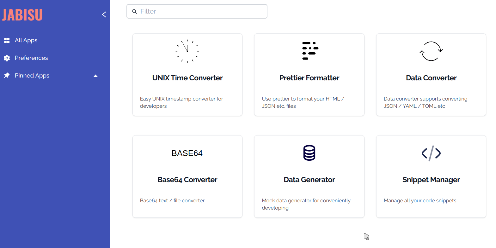

# Jabisu

A set of tools which make developing easier.

## Requirements:

1. Node.JS + NPM for running the server.
2. Golang for compiling some extensions.

## Usage:

Web pages, development mode

```
git clone --recursive https://github.com/devjabisu/jabisu.git
cd jabisu
./install_ext.sh
npm run dev // or use your preferred management tools like yarn or pnpm.
```

## Screenshots:

### All apps



### Time converter


### Prettier formatter


### Data converter


### Base64 converter


### Data generator


### Snippet manager


## Coming soon
Release versions will be provided in the future after major bugs have been fixed. May use tauri to release a standalone application version as well.
